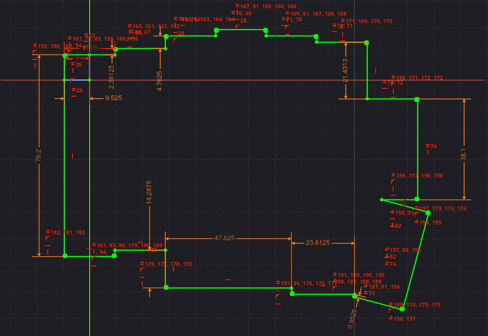
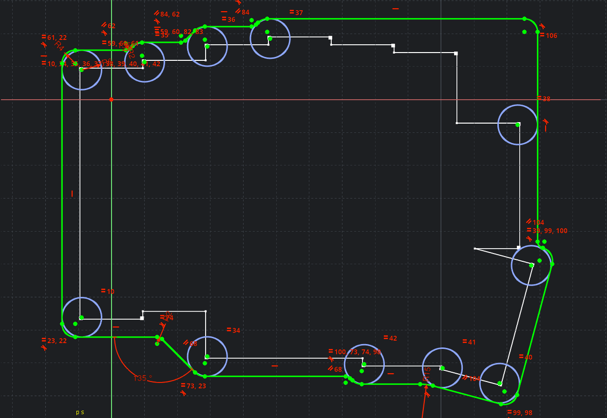
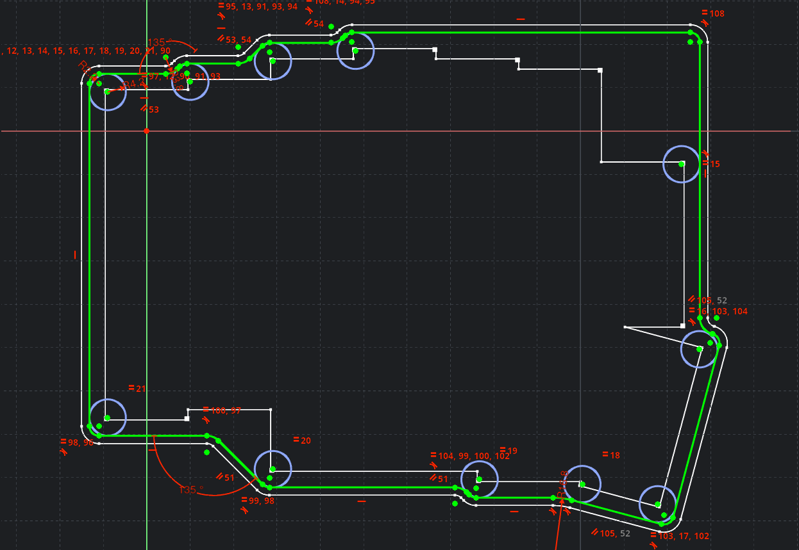
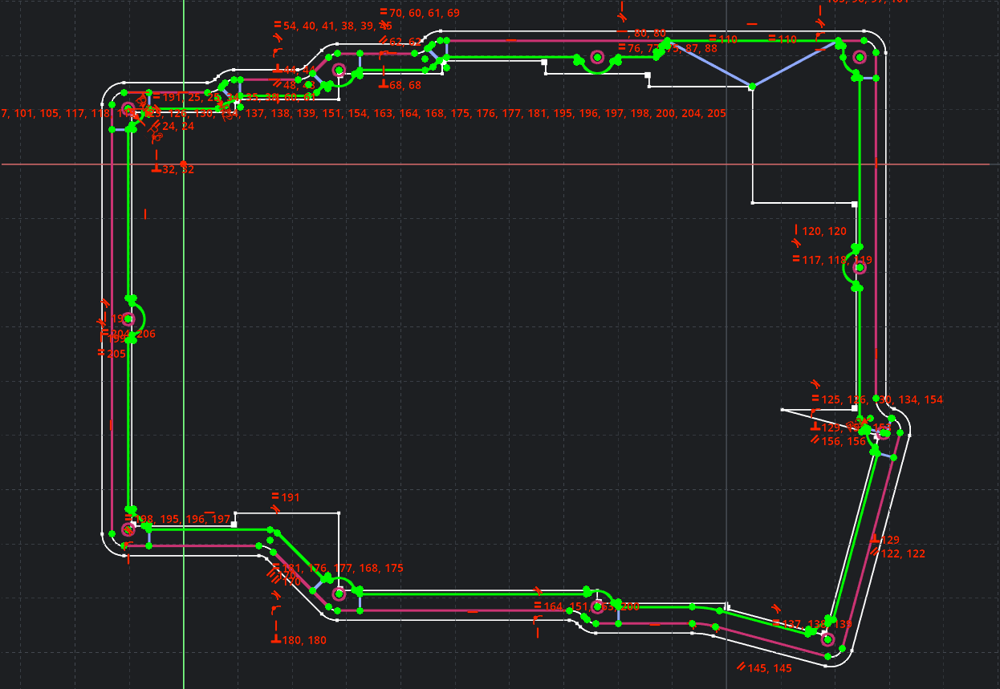
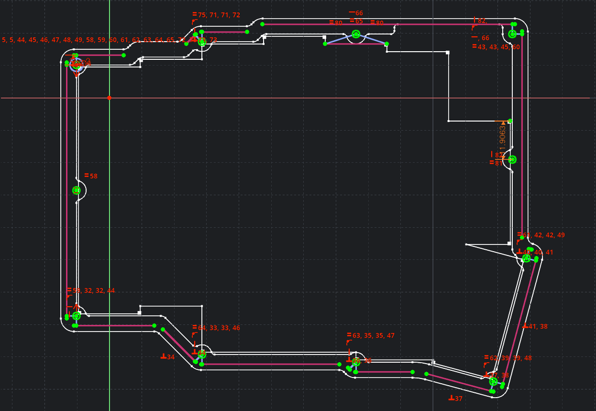
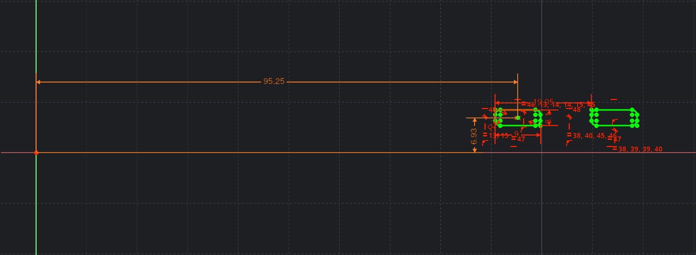

# :sparkles:

## Idee

Idee: __Gehäuse für geteilte Tastatur__

## Skizze

### Grundskizze

### Umriss

### Aussparungen für Platten

### Aushöhlung

### Löcher für Schrauben

### Löcher für Anschlüsse

## Modell

:rainbow: